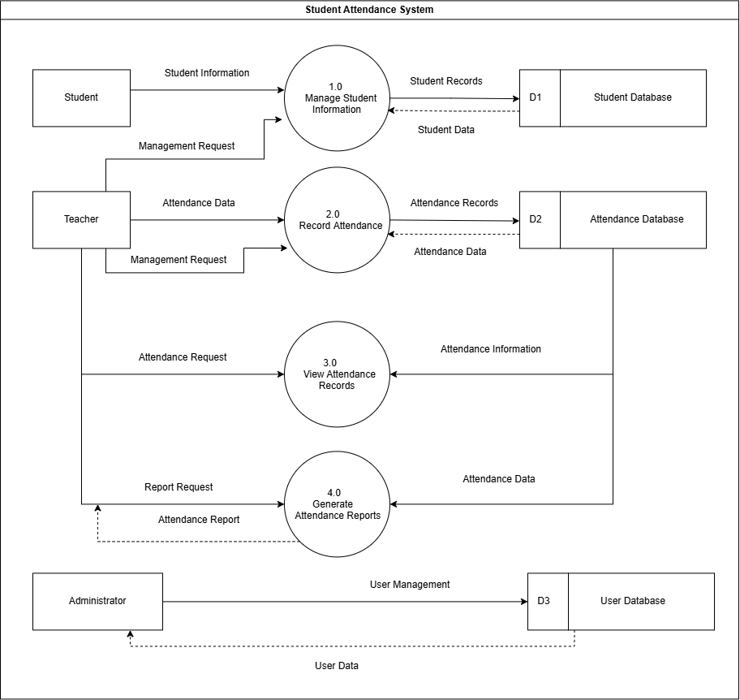
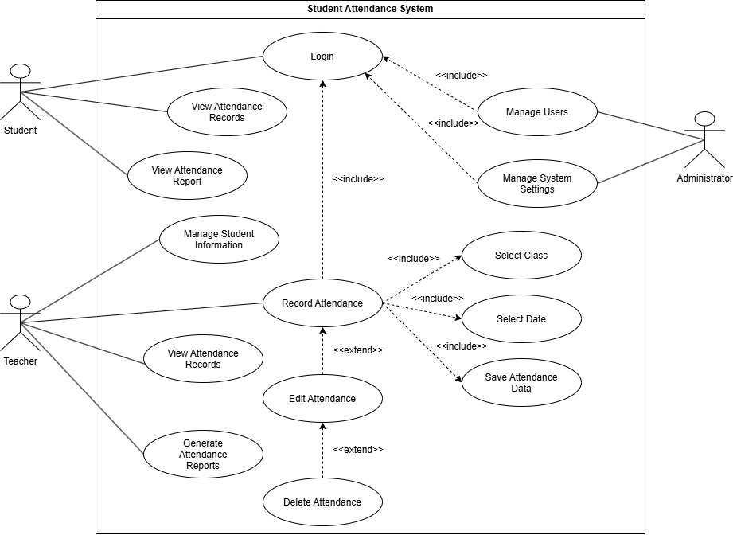
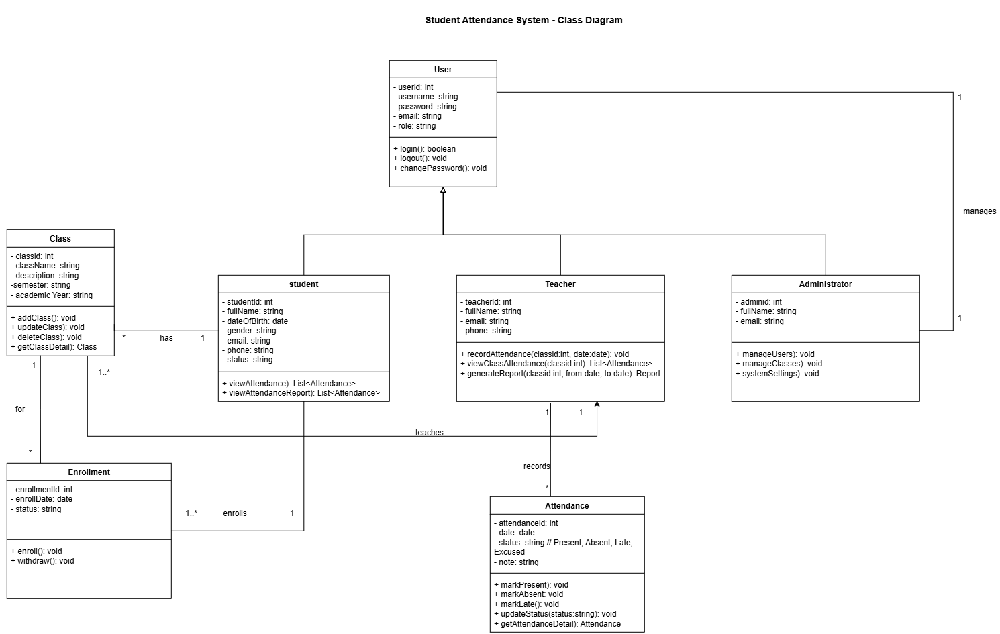

# Stage 1 - Requirements Analysis

## Student Attendance System

This stage contains the requirements analysis and system diagrams for the Student Attendance System.

## 1. Functional Requirements

### 1.1 Student
- Login to the system.
- View personal information.
- View attendance records.
- View attendance reports.

### 1.2 Teacher
- Login to the system.
- Manage student information.
- Select class.
- Select date.
- Record attendance.
- View attendance records.
- Generate attendance reports.

### 1.3 Administrator
- Login to the system.
- Manage users.
- Manage classes.
- Manage system settings.

## 2. Non-Functional Requirements

- The system should be easy to use.
- The system should provide secure user authentication.
- The system should respond quickly to user requests.
- The system should maintain accurate attendance data.
- The system should restrict functions according to user roles.
- The system should be available for authorized users.

## 3. Data Flow Diagram (DFD)

The DFD describes how data flows between students, teachers, administrators, system processes, and data stores.

## 4. Use Case Diagram

The Use Case Diagram describes the main interactions between students, teachers, administrators, and the Student Attendance System.

## 5. Class Diagram

The Class Diagram describes the main classes, attributes, methods, and relationships in the Student Attendance System.

